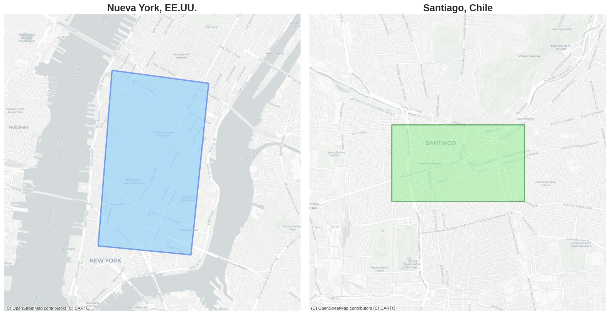

# HexConv - A ConvLSTM NN for geospatio-temporal hexagonal based data prediction

Este trabajo define una metodología de preprocesamiento hexagonal

- [Introduction](#introduction)
- [Related Work](#related-work)
- [Data Used](#data-used)
- [Proposed Method](#proposed-method)
  - [Why Hexagons](#why-hexagons)
  - [S2 vs H3](#s2-vs-h3)
- [Data Preprocessing](#data-preprocessing)
- [Networks Definition](#networks-definition)
  - [HexConvLSTM](#hexconvlstm)
  - [SquareConvLSTM](#squareconvlstm)
- [Training](#training)
- [Data Postprocessing](#data-postprocessing)
- [Results](#results)
- [Conclusion](#conclusion)
- [Acknowledgements](#acknowledgements)
- [Citing HexConv](#citing-hexconv)

## Introduction

As an introduction, this work was motivated by the [Centro de Transporte y Logística de la Universidad Andrés Bello](https://ctl.unab.cl/) (CTL) in collaboration with the [Departamento de Ciencias de la Computación de la Pontifica Universidad Católica](https://dcc.ing.uc.cl/) and [CENIA](https://cenia.cl/investigacion/).

The goal of this study is to design and develop a neural network capable of receiving hexagonally aggregated input data for the estimation of spatio-temporal variables such as traffic speed and passenger transport demand.

The neural network selected for this research is a Convolutional LSTM network. Although this model does not naturally handle hexagonal data, it offers significant advantages for estimating variables that change over both time and space, such as in videos, satellite imagery, or GPS-collected data.

In this work, we preprocess and adapt GPS data so that a ConvLSTM network can logically interpret the structure of a hexagonal topology embedded within a square grid, which is subsequently processed through a specialized kernel designed to capture the original neighbors of each hexagon.

## Related work

Un trabajo relacionado en la incorporación de hexágonos en redes neuronales profundas es el de [Hexagldy](https://github.com/ai4iacts/hexagdly), en este trabajo... mencionar cómo y para qué se aprovecharon los hexágonos aquí.

## Data Used

For this research, three datasets were used — two publicly available and one private:

| Dataset           | Period Covered             | Records     | Time Steps | Time Range            | Target Variable | Link                                                                   |
| ----------------- | -------------------------- | ----------- | ---------- | --------------------- | --------------- | ---------------------------------------------------------------------- |
| **NYC Taxi Data** | Jan 1, 2009 – Jun 30, 2010 | 92 million  | 7,098      | 8:00 a.m. – 8:00 p.m. | Pickup demand   | [Link](https://www.nyc.gov/site/tlc/about/tlc-trip-record-data.page)   |
| **UBER NYC Data** | Apr 1, 2014 – Sep 30, 2014 | 1.5 million | 2,379      | 8:00 a.m. – 8:00 p.m. | Pickup demand   | [Link](https://ieee-dataport.org/documents/uber-pickups-new-york-city) |
| **CTL Data**      | Apr 1, 2020 – Jul 25, 2020 | 0.2 million | 1,880      | 8:00 a.m. – 8:00 p.m. | Traffic speed   | Private                                                                |

Para cada una de las zonas utilizadas para este trabajo (Nueva York y Santiago) se determinó una subregión de datos densa. Esto se hizo con el fin de minimzar lo máximo posible áreas que pudieran contener muchos datos faltantes. Cabe recordar que la agrupación de los datos además de ser espacial también es temporal, lo que se traduce en que debemos asegurar registros para cada hora y para cada hexágono. Las subregiones escogidas fueron las siguientes:

## Proposed Method

The proposed method for this work involves indexing the data into hexagonal cells, preprocessing and properly adapting the data to the hexagonal pipeline through a series of matrix operations, data imputation, and the definition of a neural network combined with a specialized kernel for hexagonal convolution. The resulting data sequences are formatted as image-like tensors, where each frame corresponds to the hexagonal lattice representation and its resolution is defined by the granularity of the hexagonal tessellation.

### Why Hexagons?

Before proceeding, it is important to justify the decision to explore hexagonal convolutions instead of conventional grid-based convolutions.

A regular tessellation refers to a way of completely covering a plane using only one type of regular polygon, without leaving any gaps or overlaps between shapes. There are three possible regular tessellations: triangles, squares, and hexagons. The main reasons for choosing hexagons are neighbor traversal, subdivision, and distortion.

#### Neighbour traversal

Neighbor traversal refers to the process of exploring or iterating through the neighboring cells surrounding a given cell within a tessellation or grid. This process is fundamental in simulations, spatial models, and algorithms that rely on interactions between adjacent cells.

In this context, neighbor traversal is more convenient in hexagonal tessellations because each cell has six neighbors located at an equal distance. This uniformity simplifies mathematical computations such as distance calculations, averaging, and value propagation, making them more precise and consistent. Unlike triangular or square tessellations—which involve multiple classes of neighbors at varying distances—the hexagonal pattern maintains a balanced and homogeneous geometry, eliminating the need to distinguish between different neighbor types. As a result, algorithmic complexity is reduced and efficiency in simulations and computational models is improved. Consequently, neighbor traversal becomes more direct, coherent, and easier to implement in hexagonal tessellations.

#### Subdivision

Subdivision using hexagons is more advantageous because, although they cannot be perfectly divided like squares, their geometry allows for highly accurate approximations of areas of different sizes through rotation and alternation. This makes them ideal for representing variable scales in spatial models.

This characteristic complements the advantage of neighbor traversal, as both aspects promote mathematical uniformity and consistency: hexagons maintain equidistant spacing between neighboring cells and allow regions to be merged or subdivided without distorting the structure. Furthermore, their shape facilitates processes such as sharding, enabling efficient and continuous data partitioning across multiple levels of resolution. Overall, the hexagonal pattern provides a balanced trade-off between precision, flexibility, and computational simplicity.

#### Distorsion

Distortion is one of the most significant reasons for choosing hexagons in spatial indexing, since projecting the spherical surface of the Earth onto a plane inevitably introduces deformation. Hexagons—particularly when combined with structures such as the icosahedron and the Dymaxion projection—effectively minimize this distortion, preserving a more uniform and stable shape compared to squares or cubes. This leads to a more accurate representation of geographic areas, enhances visual coherence, and ensures a more balanced distribution of data across the plane, which is essential for modeling, geospatial analysis, and visualization applications.

  

### H3 vs S2

For the hexagonal indexing, we used [Uber's H3 library](https://h3geo.org/). However, to compare the methodology implemented in this study with a grid-based indexing system, we used [Google's S2 library](http://s2geometry.io/).

Although both libraries are conceptually related and provide hierarchical systems for partitioning the Earth’s surface, they are not directly compatible—that is, there is no 1:1 correspondence between the hexagonal cells generated by H3 and the square cells generated by S2. This incompatibility arises because each library uses different shapes and subdivision methods to discretize the Earth, as they rely on distinct projection models: H3 projects the sphere onto an icosahedron, while S2 projects it onto a cube.

Both libraries use a resolution parameter that defines the number of hexagons or squares used to aggregate the data. While increasing the resolution in either system enhances spatial detail, they do so in different ways. In H3, each level is generated by subdividing a hexagon into seven subcells, whereas in S2, each square is subdivided into four. As a result, the size and number of cells grow at different rates, and the way each system represents space does not align perfectly. Although both exhibit similar patterns when scaling, their geometric differences and distinct approaches to area coverage mean that their results never match exactly, only approximately.

In this work, we applied both libraries to our data and obtained the following:

| Zone | Resolution H3 | H3 Cells | Resolution S2 | S2 Cells |
| ---- | ------------- | -------- | ------------- | -------- |
| NYC  | 8             | 26       | 14            | 53       |
| NYC  | 9             | 126      | 15            | 187      |
| NYC  | 10            | 770      | 16            | 689      |
| SCL  | 8             | 21       | 14            | 36       |
| SCL  | 9             | 110      | 15            | 115      |
| SCL  | 10            | 667      | 16            | 430      |

Para determinar la granularidad hexagonal que ocupamos en este trabajo, lo haremos basado en el porcentaje de imputación y en las dimensiones de la matriz de entrada. Como mencionamos antes, debemos asegurar la mayor cantidad de registros para cada hora y para cada hexágono. Al mismo tiempo, también debemos asegurar que la matriz de entrada para la capa convolucional sea lo suficientemente grande para aprovechar sus capacidades de extracción de detalles espaciales. De lo contrario, no hace mucho sentido la implementación de este modelo.

La tabla a continuación nos muestra los diferentes porcentajes de imputación y dimensiones de la matriz de entrada según las diferentes granularidades hexagonales:

| Data          | Resolution H3 | H3 Cells | % of Imputation | Input Matrix Size (W x H) |
| ------------- | ------------- | -------- | --------------- | ------------------------- |
| NYC Taxi Data | 8             | 26       | [ ]             | [ ]                       |
| Uber Data     | 8             | [ ]      | [ ]             | [ ]                       |
| CTL Data      | 8             | [ ]      | [ ]             | [ ]                       |
| NYC Taxi Data | 9             | 26       | [ ]             | [ ]                       |
| Uber Data     | 9             | [ ]      | [ ]             | [ ]                       |
| CTL Data      | 9             | [ ]      | [ ]             | [ ]                       |
| NYC Taxi Data | 10            | 26       | [ ]             | [ ]                       |
| Uber Data     | 10            | [ ]      | [ ]             | [ ]                       |
| CTL Data      | 10            | [ ]      | [ ]             | [ ]                       |

Para el caso de la data de NYC Taxi Data determinamos que la granularidad de estudio será de [ ] debido a que el porcentaje de imputación es bajo y la matriz de entrada es lo suficientemente grande para ser utilizada. Siguiendo la misma lógica de balance, la granularidad para el dataset de Uber Data es de [ ] y para la data CTL Data es de [ ].

## Data Preprocessing

Una vez definida la granularidad que se utilizará para cada conjunto de datos, toca prepararlos para la adaptación de la arquitectura de nuestro modelo.

[Añadir imagenes de NYC vs SCL hex y squared]

En primer lugar, debemos representar de forma cartesiana tanto los hexágonos como las cuadriculas. Para esto ocupamos diferentes métodos dependiendo de cada librería.

Tanto H3 como S2 contienen métodos nativos para la obtención de coordenadas (i, j) de cada una de sus celdas. Con la ayuda de estos métodos pudimos obtener y normalizar ambas teselaciones en una representación cartesiana, como se muestra a continuación:

[Añadir imagenes de NYC vs SCL cartesiano]

En este punto, los datos son trabajados de tal manera de agrupar la demanada por hora y coordenadas en el caso de los datasets de Uber y de NYC Taxi, mientras que para el conjunto de datos CTL Data se agrupan los promedios de velocidades por hora y coordenadas. Adicionalmente, se realiza una imputación de datos para todos los conjuntos con el método de imputación PPCA.

En este punto, para el enfoque cuadriculado el preprocesamiento está casi listo. En cuanto al caso de las celdas hexagonales, hay que realizar un serie de pasos adicionales para la adaptación hexagonal. Al representar las celdas hexagonales en un plano cartesiano estas pierden su lógica de 6 vecinos, por lo que se debe elaborar una forma para preservarlos.

[añadir imagen de vecinos hexagonales vs vecinos en cartesiano]

Se implementaron una serie de operaciones matriciales las cuales permiten que un kernel especializado pueda identificar los vecinos originales del hexágono. Estas operaciones fueron: upsampling, padding y shifting.

Upsampling: El upsampling permitió...

[añadir imagen]

Padding: El padding permite...

[añadir imagen]

Shifting: esta operación mueve...

[añadir imagen]

Para interpretar los vecinos originales de la representación hexagonal se define el siguiente kernel:

Este filtro es capaz de recorrer el tensor de entrada de tal forma que tome el centro y los 6 vecinos originales de cada hexágono.

De esta forma, encontramos una manera para preservar los vecinos originales de la grilla hexagonal para cada celda.

En este punto, sólo queda generar nuestro tensor y definir los conjuntos de entrenamiento, validación y testeo, además de crear las secuencias para la capa LSTM de nuestra red.

## Networks Definition

### HexConvLSTM

La definición de la red está compuesta por una red ConvLSTM junto con un kernel constraint definido por.

### SquareConvLSTM

## Training HexConv

## Data Postprocessing

Para el caso del método hexagonal se debió realizar un postprocesamiento especializado capaz de revertir las operaciones definidas en [].

## Results

El conjunto de datos de CTL Data fue medido tanto contra su versión cuadriculada como contra otras redes tradicionales. Encontrando los siguientes resultados:

En cuanto a el conjunto de datos de NYC Taxi Data los resultados fueron los siguientes:

En cuanto a el conjunto de datos de Uber Data los resultados fueron los siguientes:

## Conclusion

## Acknowledgements

## Citing HexConv
